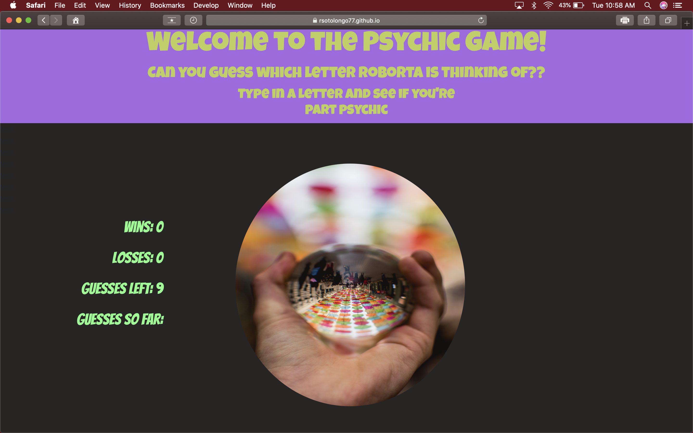

# Psychic-Game

## Psychic-Game is a web application that uses Javascript to generate a random letter. Users then attempt to guess the letter the program has chosen. 

## Technologies used:
1. HTML
<<<<<<< HEAD
2. CSS 
3. Javascript

## How the app works:
### The program selects a random left. The user is then allowed 9 chances to guess the letter chosen by the program. If the user chooses correctly they are given a "win", otherwise they are given a "loss".
=======
2. Bootstrap 
3. CSS
4. Javascript

## How the app works:
### The program selects a random letter. The user is then allowed 9 chances to guess the letter chosen by the program. If the user chooses correctly they are given a "win", otherwise they are given a "loss".
>>>>>>> e0e2be8fd48a59b6e85b5489106d4c0a31fe5268

### You can visit site at https://rsotolongo77.github.io/Psychic-Game/

